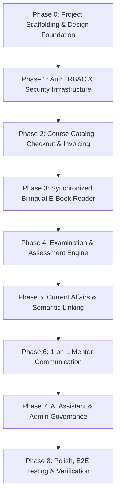

# Moving Plan for 100% Website UI Completion

This document outlines the step-by-step, phased engineering roadmap to build, integrate, and verify the entire **APPSC Prep Web Application** in the `client/` workspace from start to finish.

---

## 📈 Phased Roadmap Overview

---

## 🏗️ Phase 0: Project Scaffolding & Design Foundation

### Objective
Establish the frontend application repository in `client/` using Vite, React 18/19, Tailwind CSS v4, and the APPSC design system.

### Tasks & Implementation Steps
1. **Initialize Vite Application**:
   - Set up `client/` with `npm create vite@latest . -- --template react`
   - Configure path aliases in `vite.config.js` (`@/` -> `src/`)
2. **Install Core Dependencies**:
   - Routing: `react-router-dom` (v6/v7)
   - Styling: `@tailwindcss/vite`, `clsx`, `tailwind-merge`, `lucide-react`
   - State & Data Fetching: `@tanstack/react-query`, `zustand`, `axios`
   - Real-time & Media: `socket.io-client`, `katex`, `canvas-confetti`
3. **Core Design System**:
   - Configure curated APPSC color palette:
     - Primary: Deep Indigo / Navy (`#0f172a`, `#1e293b`)
     - Brand Accent: Saffron / Amber (`#d97706`, `#b45309`) & Crimson (`#c72018`)
     - Reader Modes: Light (`#ffffff`), Dark (`#121212`), Sepia (`#fbf0d9` / text `#5f4b32`)
   - Bilingual Typography: Load Google Fonts `Inter` (English) and `Noto Sans Telugu` (Telugu)
4. **API & Socket Client Singletons**:
   - Configure `src/services/api.js` with Axios interceptors:
     - Automatically attaches `Authorization: Bearer <accessToken>`
     - Intercepts 401 errors to trigger `/api/auth/refresh-token` seamlessly
   - Configure `src/services/socket.js` for Socket.IO connection management

---

## 🔐 Phase 1: Authentication, RBAC & Security Infrastructure
*Issues Addressed: #9 (TASK-01.1.4), #13 (TASK-01.2.2), #16 (TASK-01.3.3), #19 (TASK-01.4.2), #20 (TASK-01.4.3)*

### Tasks & Deliverables
1. **Login & OTP Verification Screen (`LoginPage`)**:
   - Split-screen UI with APPSC brand hero and responsive login card
   - Dual-step flow: Email address -> 6-digit individual OTP input boxes
   - 10-minute expiry countdown timer with active resend cooldown
   - Error alert handling rate limits (max 3 dispatches per 15 min)
2. **Client-Side Route Guards (`ProtectedRoute` & `RoleGuard`)**:
   - Strict role boundary enforcement between `STUDENT`, `MENTOR`, and `ADMIN`
   - Redirect unauthenticated users to `/login` with `returnUrl`
   - Redirect unauthorized roles to `/403` Access Denied
3. **Single Active Session Eviction Listener (`SessionTerminationModal`)**:
   - Global Socket.IO listener listening for `session_revoked` event
   - Displays modal: *"Your session has been terminated due to login from another device"*
   - Purges local storage tokens and forces browser redirection to `/login`
4. **Anti-Copy DRM Protection Layer (`ContentProtectionWrapper`)**:
   - Intercepts right-click context menu (`contextmenu` preventDefault)
   - Disables text highlighting (`user-select: none` CSS class)
   - Intercepts keyboard shortcuts (`Ctrl+P`, `Cmd+P`, `Ctrl+C`, `PrintScreen`)
5. **Dynamic Student Watermark Overlay (`WatermarkOverlay`)**:
   - Canvas/SVG watermark repeating diagonally across reading & exam viewports
   - Embeds student email, user ID, and dynamic timestamp with subtle opacity (0.07)

---

## 💳 Phase 2: Course Catalog, Checkout & Invoicing
*Issues Addressed: #89 (TASK-07.1.3), #90 (TASK-07.1.4), #92 (TASK-07.2.2), #96 (TASK-07.3.3), #100 (TASK-07.4.3), #103 (TASK-07.5.3)*

### Tasks & Deliverables
1. **Student Dashboard & Enrolled Courses (`StudentDashboardPage`)**:
   - Enrolled course cards displaying remaining validity days
   - Warning badges for courses expiring in < 7 days
   - Post-expiry read-only indicators and 1-click renewal alerts
2. **Course Catalog & Details Screen (`CourseCatalogPage`, `CourseDetailsPage`)**:
   - Filterable catalog grid with search and category tags
   - Comprehensive course syllabus breakdown (books, video lectures, test series)
   - Sticky pricing card with validity in days and "Enroll Now" CTA
3. **Razorpay Standard Checkout & Coupon Engine (`CheckoutPage`)**:
   - Interactive coupon code input widget with live validation (`POST /api/payments/coupons/validate`)
   - Razorpay Checkout modal script loader (`checkout.js`)
   - Server-side signature verification handler (`POST /api/payments/verify`)
4. **Billing History & Invoice Downloads (`StudentInvoicesPage`)**:
   - Order history table with status badges and amount
   - 1-click PDF invoice downloader streaming from `/api/payments/orders/:orderId/invoice`
5. **Video Lecture Player (`VideoLecturePlayerPage`)**:
   - HTML5 video player with speed controls (0.75x - 2x)
   - Time-limited signed URL streaming via Cloudflare R2
   - Progress autosave and course module playlist sidebar
6. **Admin Course Builder UI (`AdminCourseBuilderPage`)**:
   - Metadata editor (title, description, validity in days, pricing)
   - Drag-and-drop curriculum bundler linking videos, e-books, and test series

---

## 📖 Phase 3: Synchronized Bilingual E-Book Reader & Annotations
*Issues Addressed: #20 (TASK-01.4.3), #24 (TASK-02.1.4), #26 (TASK-02.2.2), #31 (TASK-02.3.3), #34 (TASK-02.4.2)*

### Tasks & Deliverables
1. **Dual-Pane Bilingual Reader (`BilingualReaderPage`)**:
   - Side-by-side synchronized scrolling panes (English on left, Telugu on right)
   - Scroll-lock sync ratio calculation between translation blocks
   - Theme controls: Font size slider, Light / Dark / Sepia background modes
   - Auto-save reading position on scroll pause (`PUT /api/books/:bookId/progress`)
2. **Study Annotations & Highlighter (`AnnotationPopover`, `NotesDrawer`)**:
   - Text selection popover with 4 highlight colors (Yellow, Green, Pink, Blue)
   - Study notes modal and bookmark toggle persisting to MongoDB
   - "My Notes & Bookmarks" jump navigation side drawer
3. **In-Reader Full-Text Search Drawer (`ReaderSearchDrawer`)**:
   - Keyword search across English and Telugu text blocks
   - Match snippets display with 1-click smooth scroll to exact block
4. **Admin Book Manager & Translation Review (`AdminBookManagerPage`)**:
   - Book upload modal with direct R2 upload progress
   - Side-by-side chunk inspection interface: English original vs Telugu translation
   - Inline Telugu text editing and chunk approval workflow before publishing

---

## 📝 Phase 4: Examination & Assessment Engine
*Issues Addressed: #38 (TASK-03.1.4), #41 (TASK-03.2.3), #43 (TASK-03.3.2), #48 (TASK-03.4.3), #51 (TASK-03.5.3), #52 (TASK-03.5.4)*

### Tasks & Deliverables
1. **Admin Question Bank & Bulk Importer (`AdminQuestionBankPage`)**:
   - Subject -> Topic -> Subtopic taxonomy sidebar
   - Bilingual question creation form (Question, 4 Options, Bilingual Explanation)
   - CSV and JSON bulk import modal with syntax validation and preview
2. **Admin Test Builder Wizard (`AdminTestBuilderPage`)**:
   - Rules engine: Duration, total marks, negative marking coefficient, question randomization
   - Question selector table filterable by topic and difficulty
3. **Interactive Exam Player (`ExamPlayerPage`)**:
   - Full-screen distraction-free layout with countdown timer
   - Question Palette sidebar with status colors (Not Visited, Unanswered, Answered, Marked for Review)
   - 1-Click bilingual switch (`EN` <-> `TE`) per question
   - Periodic answer autosave (`PATCH /api/exams/attempts/:attemptId/autosave`)
   - Local state backup in `localStorage` to recover from connection drops
   - Auto-submit on timer expiry
4. **Post-Submission Scorecard & Leaderboards (`TestScorecardPage`)**:
   - Score summary card: Total marks, rank, percentile, correct/incorrect/skipped tally
   - Hourly peer leaderboard standings
5. **Question-by-Question Solution Review (`SolutionReviewPage`)**:
   - Filter questions by All, Incorrect, Unattempted, Correct
   - Displays student selected option vs correct key
   - Rich bilingual explanations and topic tags
6. **Performance Analytics Dashboard (`StudentAnalyticsPage`)**:
   - Visual accuracy gauge and time analysis (average time on correct vs incorrect)
   - Topic mastery radar chart
   - Weak-topic diagnostic cards with revision recommendations

---

## 📰 Phase 5: Daily Current Affairs & Semantic Linking
*Issues Addressed: #80 (TASK-06.1.3), #82 (TASK-06.2.2), #84 (TASK-06.3.2)*

### Tasks & Deliverables
1. **Current Affairs News Feed (`CurrentAffairsFeedPage`)**:
   - Category navigation tabs: State AP, National, Economy, Polity
   - Date range picker and keyword search bar
   - 1-Click bookmark button on each article card
2. **Current Affairs Article Reader (`ArticleReaderPage`)**:
   - Typography-optimized reader view with bookmark toggle
   - **Related Syllabus Concepts Card Component (Issue #82)**:
     - Visual card rendering related textbook syllabus topics generated by backend vector embeddings
     - 1-Click link jumping straight into the Bilingual E-Book Reader at that chapter
3. **Admin Current Affairs Editor & Scheduler (`AdminCurrentAffairsEditorPage`)**:
   - Rich text article editor with category selectors and tag inputs
   - Image uploader and publication date/time scheduler

---

## 💬 Phase 6: 1-on-1 Mentor Communication Subsystem
*Issues Addressed: #55 (TASK-04.1.3), #58 (TASK-04.2.3), #61 (TASK-04.3.2), #65 (TASK-04.4.3)*

### Tasks & Deliverables
1. **Mentor Discovery & Approval Portal**:
   - Student Mentor Directory (`MentorDirectoryPage`): Browse approved educators, view bios/ratings, and connect
   - Admin Mentor Approval Portal (`AdminMentorsPage`): Review pending educator applications and approve/reject
2. **Real-Time 1-on-1 Chat Interface (`ChatRoomPage`)**:
   - Responsive split-pane layout: conversation thread list + active chat stream
   - Socket.IO integration: real-time message sending, delivery receipts (`✓`), read receipts (`✓✓`), typing indicator, and unread badges
3. **Media Attachments & Voice Notes (`ChatAttachmentModal`, `Lightbox`)**:
   - In-chat image and PDF document uploader streaming to Cloudflare R2
   - Lightbox modal for zooming into handwritten solutions
   - Inline audio player for voice notes
4. **Moderation & Chat Audit Archive**:
   - In-chat user reporting modal (`ReportModal`)
   - Admin Chat Moderation Panel (`AdminChatModerationPage`): Review flagged conversations and apply actions
   - Admin Chat Audit Archive (`AdminChatAuditPage`): Searchable conversation history and transcript inspector

---

## 🤖 Phase 7: AI Assistant & Admin Governance
*Issues Addressed: #71 (TASK-05.2.3), #77 (TASK-05.4.2), #106 (TASK-08.1.2), #109 (TASK-08.2.3)*

### Tasks & Deliverables
1. **Global AI Study Assistant Drawer (`AiAssistantDrawer`)**:
   - Persistent sliding chat drawer accessible from any student page
   - Streaming markdown response animation
   - LaTeX mathematical formula rendering via KaTeX
   - Inline Citation Pills linking directly to book and page references (clicking jumps to reader)
2. **Admin AI Settings & Index Status Dashboard (`AdminAiSettingsPage`)**:
   - Model parameters config (temperature, max tokens, external web search toggle)
   - Knowledge base index status table with chunk counts and 1-click re-index button per book
3. **Admin User Directory & Inspector (`AdminUsersPage`, `UserInspectorDrawer`)**:
   - Data table with role filters and search
   - User detail drawer showing test scores, enrolled courses, and active sessions
   - 1-Click account suspension toggle and session termination trigger
4. **Admin Audit Logs Viewer & Delta Inspector (`AdminAuditLogsPage`)**:
   - Filterable immutable log explorer: Timestamp, Actor, Action, Resource Type, IP
   - Side-by-side JSON Delta Inspector showing pre- and post-modification diffs

---

## 🧪 Phase 8: End-to-End Verification & Production Readiness

### Tasks & Deliverables
1. **Automated Component & Integration Tests**:
   - Unit tests for authentication state and token refresh loop
   - Component tests for dual-pane scroll synchronization and exam timer
   - Mocked Socket.IO tests for session eviction and real-time chat
2. **Accessibility & Responsive Polish**:
   - WCAG 2.1 AA compliance audit on colors, contrast, and keyboard navigation
   - Mobile responsive layout checks across Android / iOS screens
3. **Performance Benchmarks**:
   - Code splitting via dynamic `React.lazy()` for heavy modules (Exam Player, Reader, KaTeX)
   - Lighthouse score > 90 on Desktop and Mobile
